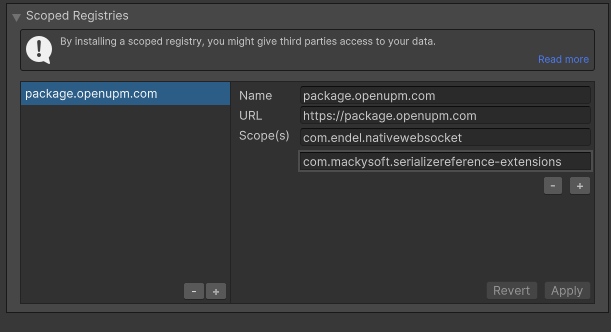

# Clayze
This is the 'Clayze' package. Clayze was developed for experimental student design research by [Hunter Dyar](htttp://hdyar.com). 

# Setup
## Prerequisites
Git must be installed on the system in order for the packages to install and update. I recommend you install Git with Winget on [Windows](https://git-scm.com/download/win), and with [Homebrew](https://brew.sh/) on [Mac](https://git-scm.com/download/mac).

## Unity Project
- Clayze is developed with Unity 2022.3, and should work with this 2022 or newer.
- URP (Universal Render Pipelinne) is recommended, as the SDF Bake tool is part of the VFX graph. It is not currently required to run.

## Installing the Package.
First, add the Scoped Registry for this project's dependencies to resolve. Then add this .git project as a package.
1. Go to Project Settings > Package Manager. 
2. Add a scoped registry:
   - Name: `package.openupm.com`
   - URL: `https://package.openupm.com`
   - Add both of the following scopes (push the little + button)
      - `com.endel.nativewebsocket`
      - `com.mackysoft.serializereference-extensions`
3. Apply. Then you can close this window.

2. Select 'Window > Package Manager'
2. Click on the plus icon, and choose 'Add Package from git URL...'.
3. Enter `https://github.com/hunterdyar/Clayze.git`
4. This will install the Clayze Package, the [Native WebSockets](https://github.com/endel/NativeWebSocket) package, and the [Serialize Reference Extensions](https://github.com/mackysoft/Unity-SerializeReferenceExtensions) package.
5. (Optional) Select the Clayze package in the Package Manager, and choose 'Samples', then import the 'Basic Usage' sample. Open and run the BasicClayzeExample scene.

# Syncing Data
There are currently 3 types of syncronizable data: Volumes via Operation Collections, 2D Drawing Canvases via an Ink Manager, and arbitrary properties (data).

Create an OperationCollection or a PropertySyncCollection (an asset/ScriptableObject), and a network initializer (A MonoBehaviour that runs calls the 'InitAndConnect' function on start).

For Volumes/Ink, create the appropriate data at runtime (A 3D Operation or Pen Stroke), and add it to the collection as shown in the Samples/Examples. The ScriptableObject handles the rest of the syncing. For Ink, the InkManager talks to a SyncPropertyCollection, as the network request.

Arbitrary Properties work a bit differently. For these, create (ahead of time), ScriptableObjects of the appropriate type. These will be given a unique ID that must match to the other projects. Add all these properties to the SyncPropertyCollection, or they won't be synced. InkManager uses TransformMatrix properties to synronize Canvas locations, it has an array of tham that should match the byte-id of the 'matrixID' property of the canvas.

You can have multiple OpCollections and SyncPropertyCollections going to different servers or the same server. Each one creates it's own websocket connection.
